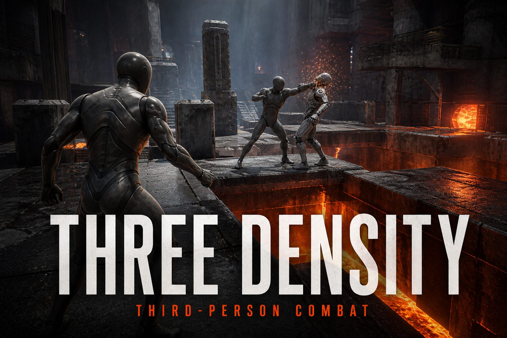

  

# Three Density

  

**Three Density** is a third-person combat action game built with **Unreal Engine 5.7**. Fight through enemy pressure, master combos and charged strikes, and survive lava arenas.

## Download

**[Download the Windows installer](https://github.com/HyperlinksSpace/threedensity/releases/latest/download/ThreeDensitySetup.exe)** (~15 KB)

The installer fetches the latest full build, installs it, and creates a desktop shortcut.

Game page: **[hyperlinksspace.github.io/threedensity](https://hyperlinksspace.github.io/threedensity/)**

Portable ZIP (optional): [ThreeDensity-Win64.zip](https://github.com/HyperlinksSpace/threedensity/releases/latest/download/ThreeDensity-Win64.zip)

## In-game

- **Esc / Start** — pause menu with full **controls cookbook** and **graphics settings**
- Onboarding tips appear in the first moments of play
- First launch **auto-detects your GPU/RAM** and applies Low / Medium / High / Epic (you can retune anytime)

## Controls

| Action | Keyboard | Gamepad |
|---|---|---|
| Move | W A S D | Left Stick |
| Look | Mouse | Right Stick |
| Jump | Space | A / Cross |
| Combo attack | Left Mouse | RT / R2 |
| Charged strike | Hold Right Mouse | Hold RB / R1 |
| Camera shoulder | Q | LB / L1 |
| Menu | Esc | Start |

## System Requirements

| | Minimum | Recommended |
|---|---|---|
| **OS** | Windows 10 64-bit | Windows 11 64-bit |
| **CPU** | Quad-core 2.5 GHz | 6-core 3.0 GHz |
| **RAM** | 8 GB | 16 GB |
| **GPU** | DirectX 12, 4 GB VRAM | DirectX 12, 8 GB VRAM |
| **Storage** | 1 GB | 1 GB SSD |

## Build from Source

Requires Unreal Engine 5.7. Open `threedensity.uproject`, or package with `RunUAT BuildCookRun`.

## License

Game code follows the Unreal Engine EULA. Template content © Epic Games, Inc.
